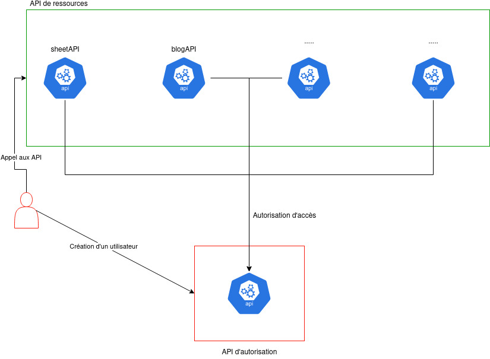
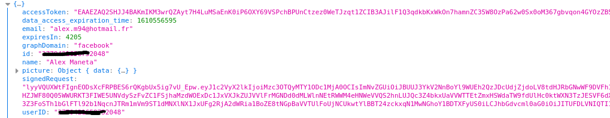
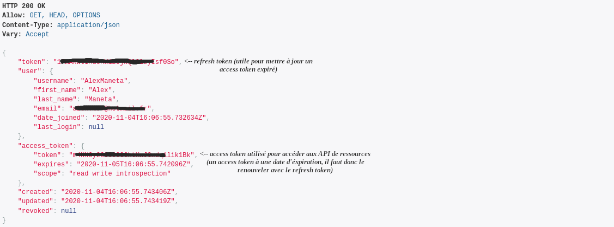
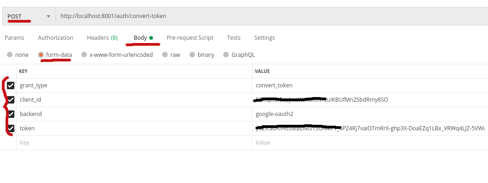

# Authentification et permissions : API

_________
## A quoi ça sert ?
La mise en place d'authetification et de permissions permet de sécuriser l'accès aux API. Cela permet donc d'éviter les abus tel que le vol de données. Pour mettre en place ce système, les API s'appuie sur le protocoloe **OAuth**.

___________
## Architecture : comment sont organisées les API ?
Le projet est organisé en plusieurs microservices. Chaque microservice représente une API qui doit être protégée par le protocole Oauth.
Une distinction est faite au niveau des API. En effet, la totalité des API (sauf une) sont considérées comme des API de **ressources**.
En revanche l'API qui gère les utilisateurs est appelée API **d'autorisation**. C'est cette dernière qui gère la création, la modification et la suppression des utilisateurs (mais pas que...). Elle gère aussi la **validation d'accès** aux autres API.
 
 
Comment ça marche ? Le processus d'autorisation repose sur un système de token. Pour avoir accès aux données, il est nécéssaire d'avoir un token d'accès (**access_token**).
 
 

Voici ci-dessous une vue d'ensemble de l'architecture :

___________
## Outils utiles pour les API

Pour utiliser et tester en toute sérénité les API, vous avez la possibilité d'utiliser deux outils :

- Postman (*fortement conseillé*)
- cURL (outil CLI)
  
Postman tout comme cURL permet de faire des appels HTTP aux API. cURL est un outil en ligne de commande, ce qui le rend plus difficile d'utilisation. C'est pourquoi je vous conseille fortement d'utiliser **Postman**. Cet outil possède toutes les fonctionnalités nécéssaires à l'utilisation des API :

- Token d'identification
- Historique
- Conversion des requêtes en code JS, Python, cURL, Java...
- Sauvegarde des réponses et des requêtes

__________
## Flot de connexion : comment connecter un utilisateur ? 

Dans cette partie, nous allons voir le **le processus de connexion utilisateur**. Que ce soit sur l'interface web ou mobile, les utilisateurs se connectent via un bouton *Google* ou *Facebook*. Après avoir appuyé, vous êtes supposé recevoir une réponse de Google ou Facebook en fonction du bouton sur lequel vous avez appuyé.

Cette réponse contient plusieurs informations intéressantes :

Les deux éléments à retenir sur cet objet JS sont **l'access token** ainsi que **l'id**.

Dans un premier temps, nous allons utiliser le champ **id** en faisant appel à l'url suivante pour vérifier que l'utilisateur existe : 
`http://<url_serveur_authent>/user/<id>/<provider> --> http://localhost:8001/user/************2048/facebook` 

Les choix disponibles pour `<provider>` sont : 

- facebook
- google-oauth2

L'appel à cette URL nous donne deux réponses possibles :

- Un JSON indiquant que rien n'a été trouvé
- Un JSON avec des informations concernant l'utilisateur déjà existant sur l'api d'authentification

Voici une image qui montre à quoi ressemble une réponse correcte (avec des annotations pour les champs importants) :

 
 
S'il s'avère que l'utilisateur n'existe pas sur l'api d'authentification, il vous faudra convertir l'access token qui vous est fourni par Facebook/Google en token propre à notre API.

Pour ce faire voici l'appel que vous devez effectuer (les éléments importants sont en rouge):

Le champ *token* correspond au champ *access token* de l'objet renvoyé par les boutons de login. Il y a deux valeurs possibles pour le backend (voir liste plus haut).
Enfin pour le champ *client_id*, il est possible de l'obtenir via le panel admin de l'api (ou alors demander à M. MANETA).

Si la requête est fructueuse, vous obtiendrez un **access token** ainsi qu'un **refresh token** (qui permet de rafraîchir l'access token en cas d'expiration) que vous devez garder soigneusement pour faire des requêtes sur les API *ressources*.

Pour récapituler, vous devez d'abord vérifier l'existence de l'utilisateur via la première URL qui est fournie dans cette section. Si l'utilisateur n'existe pas, il faut donc convertir le token d'accès fourni par Facebook/Google via la seconde URL. Vous obtenez ensuite un token d'accès propre à notre api qui découle de celui de facebook ou google. Le token de notre API à une date d'expiration. SI cette date est atteinte, le token d'accès n'est plus valide. Il vous faut donc le rafraîchir (voir la section '[Testing the Setup](https://github.com/RealmTeam/django-rest-framework-social-oauth2)').

## Token d'accès : comment l'utiliser ?

Une fois le token d'accès en main, vous pouvez accéder à n'importe quelle donnée sur les API de ressources. Pour ce faire, il faut ajouter le token dans l'en-tête de la requête : 
 
 
`curl --location --request GET 'http://localhost:8000/sheettag/' --header 'Authorization: Bearer <access_token_de_notre_api>'`

L'ajout de ce token permet d'accéder aux données. Sans ce token, un JSON d'erreur vous sera renvoyé.