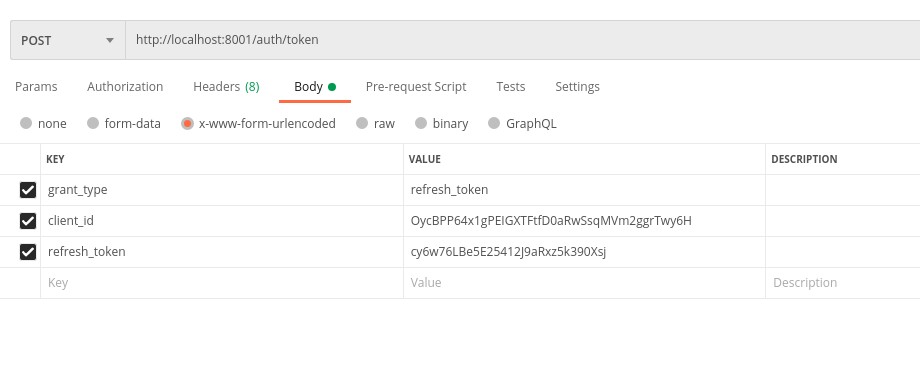
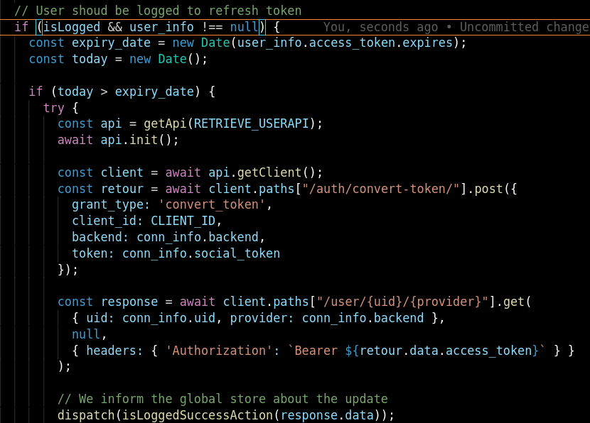

# Authentification et permissions : API

_________
## A quoi ça sert ?
La mise en place d'authentification et de permissions permet de sécuriser l'accès aux API. Cela permet donc d'éviter les abus tel que le vol de données. Pour mettre en place ce système, les API s'appuie sur le protocoloe **OAuth**.

___________
## Architecture : comment sont organisées les API ?
Le projet est organisé en plusieurs microservices. Chaque microservice représente une API qui doit être protégée par le protocole Oauth.
Une distinction est faite au niveau des API. En effet, la totalité des API (sauf une) sont considérées comme des API de **ressources**.
En revanche l'API qui gère les utilisateurs est appelée API **d'autorisation**. C'est cette dernière qui gère la création, la modification et la suppression des utilisateurs (mais pas que...). Elle gère aussi la **validation d'accès** aux autres API.
 
 
Comment ça marche ? Le processus d'autorisation repose sur un système de token. Pour avoir accès aux données, il est nécéssaire d'avoir un token d'accès (**access_token**).
 
 

Voici ci-dessous une vue d'ensemble de l'architecture :

___________
## Outils utiles pour les API

Pour utiliser et tester en toute sérénité les API, vous avez la possibilité d'utiliser deux outils :

- Postman (*fortement conseillé*)
- cURL (outil CLI)
  
Postman tout comme cURL permet de faire des appels HTTP aux API. cURL est un outil en ligne de commande, ce qui le rend plus difficile d'utilisation. C'est pourquoi je vous conseille fortement d'utiliser **Postman**. Cet outil possède toutes les fonctionnalités nécéssaires à l'utilisation des API :

- Token d'identification
- Historique
- Conversion des requêtes en code JS, Python, cURL, Java...
- Sauvegarde des réponses et des requêtes

__________
## Flot de connexion : comment connecter un utilisateur ? 

Dans cette partie, nous allons voir le **le processus de connexion utilisateur**. Que ce soit sur l'interface web ou mobile, les utilisateurs se connectent via un bouton *Google* ou *Facebook*. Après avoir appuyé, vous êtes supposé recevoir une réponse de Google ou Facebook en fonction du bouton sur lequel vous avez appuyé.

Cette réponse contient plusieurs informations intéressantes :

L'élément à retenir est **l'access token**. Le champ *client_id* est visible dans le panel admin de l'api. Voici un exemple de requête sur l'url de conversion de token

Les choix disponibles pour `<backend>` sont : 

- facebook
- google-oauth2

L'appel à cette URL permet de créer un **access_token** et son **refresh_token** associé. Il n'y as pas de besoin d'ajouter d'information dans les *headers* pour faire appel à cette URL. Si la requête est valide, vous obtiendrez les deux éléments cités ci-dessus avec d'autres informations en plus (date d'expiration...).
 
 
Une fois cette étape faite, vous devez obtenir des informations complémentaires sur l'utilisateur. Pour ce faire, vous devez passer par l'URL suivante :

`http://<url_serveur_authent>/user/<id_provider>/<provider>`  
`http://localhost:8001/user/************2048/facebook`

NB : pour facebook le userID est un un **nombre** et pour google il s'agit du **mail** du compte que vous tentez de vérifier.

Les choix disponibles pour `<provider>` sont : 

- facebook
- google-oauth2

Voici une image qui montre à quoi ressemble une réponse correcte (avec des annotations pour les champs importants) :

Pour récapituler, il suffit d'effectuer un convert-token à chaque connexion de l'utilisateur. Si l'utilisateur n'existe pas, un compte et des tokens sont créés. Ensuite, il faut obtenir plus d'informations sur l'utilisateur en appelant l'URL prévu à cet effet. Il est important de noter que pour accéder à cette URL, il faut ajouter **l'access token** de notre api dans les headers de la requête (voir dernière section). Le token de notre API à une date d'expiration. Si cette date est atteinte, le token d'accès n'est plus valide. Il vous faut donc le rafraîchir (voir la section '[Testing the Setup](https://github.com/RealmTeam/django-rest-framework-social-oauth2)'). Sous React, le raffraîchissement se fait via un middleware. Sous Flutter, il est possible d'implémenter un *interceptor* qui vérifiera la date d'expiration du token d'accès.
 
 
Voici un exemple où l'on raffraîchit un token:

## Token d'accès : comment l'utiliser ?

Une fois le token d'accès en main, vous pouvez accéder à n'importe quelle donnée sur les API de ressources. Pour ce faire, il faut ajouter le token dans l'en-tête de la requête : 
 
 
`curl --location --request GET 'http://localhost:8000/sheettag/' --header 'Authorization: Bearer <access_token_de_notre_api>'`

L'ajout de ce token permet d'accéder aux données. Sans ce token, un JSON d'erreur vous sera renvoyé.

## Rafraîchir le token d'accès, comment faire ?

Les tokens d'accès fourni par l'API d'authentification Sheeter ont une durée **d'une journée**. Il est donc nécessaire de les rafraîchir afin que les utilisateurs puissent utiliser les services Sheeter sans coupure. Comme mentionné un peu plus haut, il existe deux techniques (une pour chaque plateforme) pour raffraîchir les tokens. Sous l'environnement web, il faut implémenter un **middleware** qui vérifiera après chaque appel auprès du store global de l'application que le token d'accès est toujours valide. En ce qui concerne l'environnement mobile, il faut mettre en place un **interceptor** qui, comme son nom l'indique, intercepte la requête avant qu'elle ne soit envoyée aux API et effectue le traitement de raffraîchissement si nécessaire.

Prenons pour exemple le middleware de l'application web Sheeter et décrivons le fonctionnement ligne par ligne : 

Avant de vérifier la date d'expiration, il est obligatoire de vérifier si l'utilisateur est bien connecté à l'application. Ensuite, il faut convertir la *string* de la date d'expiration en un *objet date*. Il suffit alors de comparer la date du jour et la date d'expiration. Si la date du jour est plus récente, il faut donc raffraîchir le token. Dans notre cas, nous faisons appel à l'API s'occupant de cette tâche là (localhost:8001). Le flôt de communication entre l'application et l'API est le même que celui de connexion. Il faut convertir le token du provider (Google, FB) en renseignant les informations imporantes : CLIENT_ID, backend, token du provider et enfin le grant_type.
 
 
Il suffit ensuite d'aller chercher des informations complémentaires sur l'utilisateur. Pour ce faire, on fait appel à la deuxième URL que l'on voit dans le bout de code (toujours le même serveur). Il est important de noter que l'on rajoute une information dans les headers. Il s'agit du **Bearer token** qui permet d'authentifier la requête. Si cet élément n'est pas présent dans l'en-tête de la requête alors cette dernière ne fonctionnera pas.