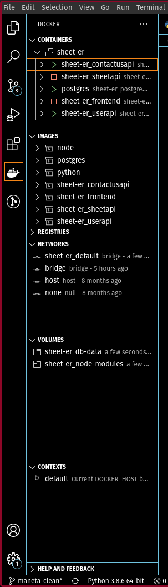
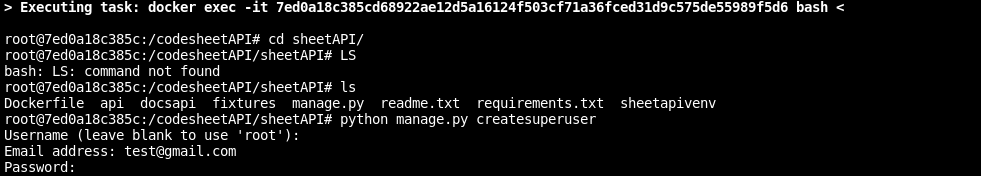
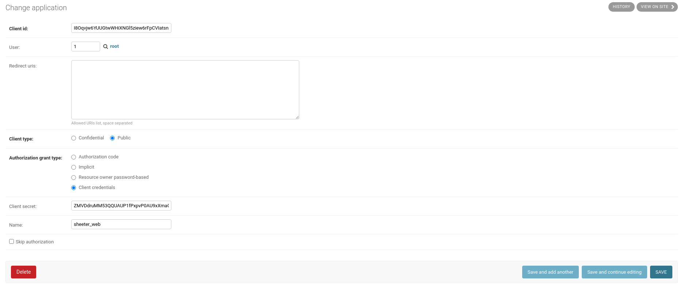

# Comment construire le projet

___________

## 1. Avant-propos

Avant de commencer, il est préférable d'être sous un environnement Linux. 
Pour clarifier toute ambiguïté, la démonstration de l'installation se fait sous un environnement Linux (*POP OS* basée sur *Ubuntu*). Par conséquent, toutes les commandes qui vont être fournies sont des commandes Shell.

Il faudra par la suite installer [Docker](https://docs.docker.com/engine/install/ubuntu/) sur votre machine. Il suffit de copier les commandes présentes sur le lien. De la même manière, [docker-compose](https://docs.docker.com/compose/install/) doit être sur votre machine.

> Si vous êtes sous windows veuillez utiliser [cet installeur](https://drive.google.com/drive/folders/1sDfgliyaf-ckIKJyB9rKNKL2zplIUHrc?usp=sharing) avec WSL 2 utilisant Ubuntu. Vous pouvez également utiliser une VM avec Ubuntu.

Vous pouvez également installer ces différents outils facilitant grandement l'utilisation de **Docker** et **docker-compose** :

- *Visual Studio Code* : extensions Docker et docker-compose
- *Dockstation* : permet de visualiser les conteneurs présents sur votre machine
___________
## 2. Structure du projet avec Docker/Compose et fonctionnement

Ce projet s'appuie sur ces technologies afin de permettre de constuire automatiquement les environnements techniques nécéssaires au bon fonctionnement des éléments de Sheet-er.

À la racine du projet, on retrouve un fichier nommé **docker-compose.yml**. Ce fichier s'appuie sur plusieurs **Dockerfile**. 

Les **Dockerfiles** sont des blocs élémentaires qui doivent se retrouver dans chaque sous projet (i.e sheetAPI, sheeter_user_interface...). Ils permettent de générer l'environnement minimum permettant au sous-projet de fonctionner.

<br>
<br>
On dit souvent :
> Un exemple vaut mieux que mille mots

Détaillons alors le fichier **Dockerfile** présent dans le dossier  */sheetAPI*

```Dockerfile 
FROM python:3.8-slim
ENV PYTHONUNBUFFERED 1

WORKDIR /code

COPY . .
RUN pip install -r requirements.txt

EXPOSE 8000
CMD ["python", "manage.py", "runserver", "0.0.0.0:8000"]
```

<br>
<br>
Le bout de code ci-dessous permet de prendre une image minimaliste de Linux avec une installation python3.8 ([+ d'infos sur l'image](https://hub.docker.com/_/python)). La deuxième permet de mettre en place une variable d'environnement nommée *PYTHONUNBUFFERED* ayant pour valeur 1.

```Dockerfile
FROM python:3.8-slim
ENV PYTHONUNBUFFERED 1
```

<br>
<br>

La première ligne permet de définir le dossier sur lequel on souhaite travailler. Par conséquent, les commandes `RUN , CMD , ADD , COPY , ENTRYPOINT` utiliseront le dossier spécifié par la commande `WORKDIR`.

La deuxième commande `COPY <src> … <dest>` copie :O le contenu du dossier dans lequel se trouve le *Dockerfile* dans le dossier du conteneur nommé */code*.

La dernière ligne est une ligne qui participe à la construction du conteneur (ici on installe les modules Python) : `RUN <my_command>` ou `RUN ["executable", "param1", "param2"]`

```Dockerfile 
WORKDIR /code

COPY . .
RUN pip install -r requirements.txt
```

<br>
<br>

La première ligne permet d'exposer le port 8000 du conteneur (port que l'on utilise juste en dessous) afin que le conteneur puisse communiquer avec les autres conteneurs.
La dernière ligne est similaire à la commande `RUN` à la seule différence que `CMD` n'est interprétée que lorsque le conteneur est construit ([voir subtilité](https://stackoverflow.com/questions/37461868/difference-between-run-and-cmd-in-a-dockerfile)).

```Dockerfile
EXPOSE 8000
CMD ["python", "manage.py", "runserver", "0.0.0.0:8000"]
```
__________
## 3. Construction du projet


Il est possible d'utiliser [les outils](#1-avant-propos) Visual Studio Code pour construire le projet grâce à *docker-compose*. Pour ce faire, il faut ouvrir la palette des commandes `Ctrl+Shift+p` et lancer la commande : **Docker compose up**.

Il y a des chances que vous rencontriez une erreur concernant un port bloqué. Dans ce cas là, il faut fermer le processus/service qui utilise ce port et relancer la commande.

Si vous n'êtes pas sous VS code, la commande permettant de construire le projet est la suivante : `docker-compose  up -d --build` (**Elle doit être lancée à la racine du projet**).

Pour s'assurer du bon déroulement de l'étape, vous pouvez utiliser *Dockstation* ou *l'extension Docker*.

Ci-dessous une démonstration de l'interface *Dockstation* :


____________

## 4. Env de développement python

Les *API REST* sont fait en python à l'aide de [Django Rest Framework](https://www.django-rest-framework.org/). Ces API utilisent une quantité importante de modules Python. Il est donc nécessaire de les installer lorsque vous êtes en train de développer l'application sur votre poste personnel. Tout d'abord, vous devez installer le langage [Python](https://www.python.org/) sous une version 3.7/3.8.

Pour éviter de polluer votre poste avec une quantité inombrable de modules, il faut pouvoir créer des environnements virtuels python à l'aide de [venv](https://docs.python.org/3.7/tutorial/venv.html). 

Après activation de votre environnement virtuel, il suffit d'installer les modules python à l'aide de l'une des commandes :

- `pip install -r requirements.txt` 
- `pip3 install -r requirements.txt`

Les fichiers **requirements.txt** sont présents à la racine de chaque sous projet utilisant Python.

________________________

## 5. Setup du projet pas à pas

Sur cette partie, nous allons voir comment mettre en place le projet du début jusqu'à la fin sur votre poste local.
<br>
<br>
Pour commencer, il va falloir installer [docker](https://docs.docker.com/engine/install/) et [docker-compose](https://docs.docker.com/compose/install/). Il vous suffit de choisir la distribution Linux adéquate et suivre les étapes d'installation. Un problème que l'on rencontre souvent après avoir installé ces deux outils est la gestion des droits pour Docker. pour régler le problème. Il faut suivre les instructions de cette [page](https://docs.docker.com/engine/install/linux-postinstall/).


Une fois ces deux éléments installés, il vous faut choisir un IDE. Il est fortement conseillé d'utiliser **VSCode** car une [configuration](https://gist.github.com/Recursived/90daa030278cce6abd2f007da7955516) est disponible pour ce dernier. Pour utiliser ce fichier de configuration, il faut installer l'extension VSCode ['Settings Sync'](https://marketplace.visualstudio.com/items?itemName=Shan.code-settings-sync). Cette extension vous demandera de connnecter votre compte github à l'IDE.
Pour finir, 'Settings Sync' est censé installer plusieurs extensions facilitant le développement pour le projet Sheeter (ex: Docker, Gitlens, Markdown, Python...). Un problème que l'on peut rencontrer lors de l'installation est qu'il existe déjà des extensions sur votre VSCode. Pour contourner le problème, il faut supprimer les extensions que vous possédez déjà. Il suffira de les réinstaller après avoir suivi les étapes précédentes.
<br>
<br>
Nous allons à présent rentrer dans le vif du sujet en construisant les conteneurs docker du projet **Sheeter**. Dans un premier temps, il faut vous rendre sur l'extension **Docker**.



Lorsque vous arrivez sur l'extension (carré orange sur l'image), vous allez faire face à l'interface ci-dessus. Les seuls éléments qui peuvent différer sont la zone **CONTAINERS** qui est vide s'il s'agit de la première installation Docker (ou un problème de connexion si la gestion des droits Docker est incorrecte). La zone **IMAGES** sera probablement vide tout comme la zone **VOLUMES**. La zone **NETWORKS** sera différentes à quelques lignes près.
<br>
<br>
Si vous n'avez pas de problèmes de droits au niveau du service Docker, vous allez pouvoir construire les conteneurs Docker du projet en écrivant la commande suivante `docker-compose up -d --build` ou en cherchant la commande *docker compose up* avec le shortcut `CTRL + MAJ + P` (faire la commande à la racine du projet).
<br>
<br>
Après cette commande, plusieurs réponses peuvent s'offrir à vous. 
- La commande a fonctionné et vous pouvez observer dans la zone **CONTENEURS** 5 conteneurs différents avec un indicateur vert
- Une erreur concernant un port qui indique vraisemblament que ce dernier est déjà occupé (voir ports dans le fichier *docker-compose.yml*) --> il faut *kill* le processus qui l'occupe
- Un problème concernant l'interface WEB et l'installation des dépendances JS --> il faut supprimer le fichier package-lock.json et refaire l'installation avec la commande npm install au niveau du dossier *sheeter_user_interface*
- Un problème concernant la migration de données --> enlever la commande **loaddata, makemigrations et mirgate** sur le fichier *docker-compose.yml* et relancer la commande `docker-compose up -d --build` 
- Dépendances JS pas MAJ sur le conteneur *frontend* --> supprimer dans la zone **VOLUMES** le dossier *sheeter_node_modules* et refaire la commande compose / éteindre le conteneur frontend et installer les dépendances directement sur votre poste et non pas sur le conteneur (faire l'installation avec la commande npm install au niveau du dossier *sheeter_user_interface* et lancer le serveur via la commande `npm run`)
- Autres poblèmes --> Google ou Alexandre MANETA (ensuite rajouter à cette liste)
<br>
<br>
Une fois tous les problèmes réglés, il faut mettre en place les apis en commençant par créer les utilisateurs 'root'. Pour ce faire, il faut ouvrir un terminal lié au conteneur avec la commande `docker exec -it <nom_du_conteneur> bash` ou faire un **clic droit + attach shell**  sur le conteneur dans l'interface de l'extension docker sur VSCode. Il faut ensuite se rendre dans le dossier de l'api REST django qui correspond au conteneur que vous avez ouvert et lancer la commande `python manage.py createsuperuser`. Vous devez répéter ce process pour toutes les apis REST Django.




Vous avez maintenant accès au panel admin de chaque API. Pour se rendre sur ce dernier, vous devez rentrer l'URL `http://localhost:<port_de_lapi>/` et remplir le formulaire de connexion avec les logins des utilisateurs 'root' que vous avez créés.
<br>
<br>
Pour la prochaine étape, vous allez devoir créer des *'Application'* sur le panel admin de l'API utilisateur (http://localhost:8001/) qui vont permettre de sécuriser les communications avec les API. Nous allons pour cette exemple en créer trois : un pour l'interface web, un pour le mobile et un pour l'instrospection.

Pour *l'interface web ainsi que mobile*, vous devez créer une application ayant pour **client type** 'Public' et pour **Authorization grant type** 'Client credentials'. Vous pouvez donner le nom que vous voulez à l'application.
<br>
<br>
Pour *l'introspection*, vous devez créer une application ayant pour **client type** 'Confidential' et pour **Resource owner password-based** 'Client credentials'.



Pour l'application ciblant l'interface web, vous devez prendre le client ID et vous rendre sur le fichier **api.js** dans le dossier *sheeter_user_interface* afin de changer la clé. Il faut suivre le même procédé pour le mobile en prenant le client ID correspondant. 

Enfin, il va falloir changer la paire (client id, client secret) pour le paramètre d'introspection dans le fichier **settings.py** de toutes les API sauf *userAPI*.
Vous pouvez désormais utiliser l'application à son plein potentiel et développer de nouvelles fonctionnalités.